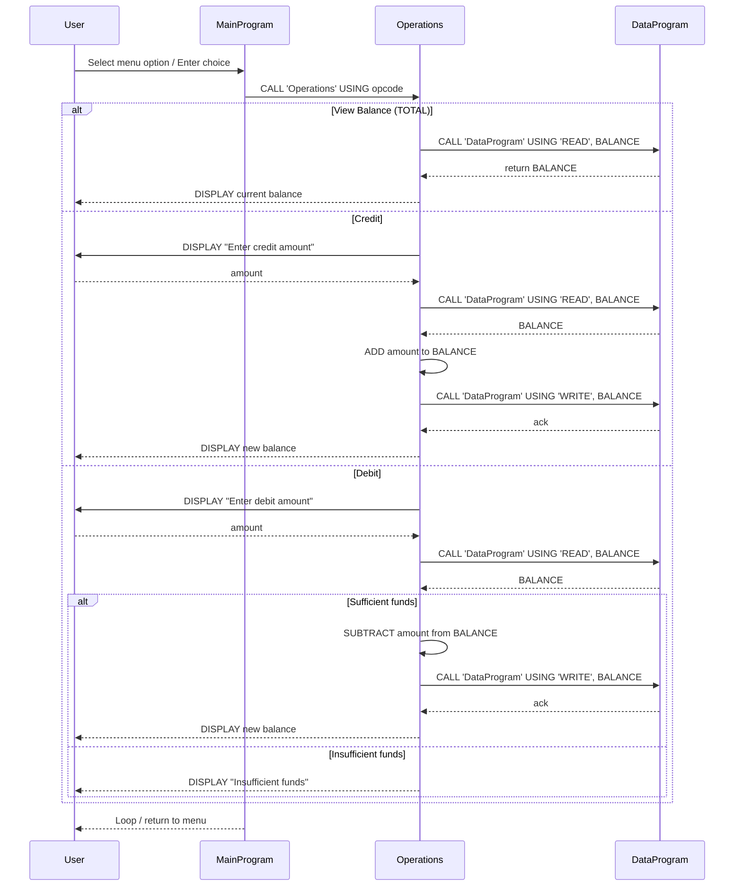

# School Accounting System (COBOL) — Developer Notes

## Overview

This small COBOL program provides a minimal account management system used by the school's accounting example. It is menu-driven and split into three files that separate the user interface, business logic (operations), and the data interface.

## Files

- `src/cobol/data.cob`
  - Purpose: Data layer — exposes a simple read/write interface for the account balance.
  - Key items:
    - `STORAGE-BALANCE` (WORKING-STORAGE) — `PIC 9(6)V99`, initialized to `1000.00`.
    - `PROCEDURE DIVISION USING PASSED-OPERATION BALANCE` — accepts an operation code and a balance parameter.
    - Supports operation types: `'READ'` (copy `STORAGE-BALANCE` → `BALANCE`) and `'WRITE'` (move `BALANCE` → `STORAGE-BALANCE`).
  - Notes / business rules:
    - Single in-memory balance: updates are not persisted between program runs.
    - Operation codes are fixed-width (6 characters); calling code pads codes (e.g. `'TOTAL '` or `'DEBIT '`).

- `src/cobol/operations.cob`
  - Purpose: Business-logic layer — implements account operations called by the menu.
  - Key items:
    - `FINAL-BALANCE` (WORKING-STORAGE) — `PIC 9(6)V99` (default `1000.00`).
    - `AMOUNT` (WORKING-STORAGE) — `PIC 9(6)V99` for credit/debit amounts.
    - Accepts a linkage parameter `PASSED-OPERATION` and dispatches on operation type.
    - Calls `DataProgram` to `READ` and `WRITE` the balance.
  - Supported operations & rules:
    - `TOTAL` — displays the current balance (calls `DataProgram` using `'READ'`).
    - `CREDIT` — prompts for amount, reads current balance, adds amount, writes updated balance.
    - `DEBIT` — prompts for amount, reads current balance, checks `FINAL-BALANCE >= AMOUNT`; if true, subtracts and writes new balance; otherwise displays "Insufficient funds".
    - Numeric formats use fixed-point `PIC 9(6)V99` (two decimal places).

- `src/cobol/main.cob`
  - Purpose: User interface / program flow — menu loop that accepts user choices and calls `Operations`.
  - Key items:
    - Displays menu with options: 1 (View Balance), 2 (Credit), 3 (Debit), 4 (Exit).
    - Uses `CALL 'Operations' USING '<OPCODE>'` where `<OPCODE>` is a padded 6-character operation code.
    - Loop continues until user selects Exit (`4`).

## Important business rules (summary)

- Initial balance is 1000.00 by default, defined in working-storage (`STORAGE-BALANCE` / `FINAL-BALANCE`).
- All money values are stored as `PIC 9(6)V99` (maximum 6 digits before decimal, 2 after).
- Debits are allowed only when the current balance is greater than or equal to the debit amount; otherwise the operation is rejected with an "Insufficient funds" message.
- The system uses in-memory working storage only — there is no persistence layer. All updates are lost when the program exits.
- Operation codes are expected to be exactly 6 characters (space-padded where necessary).

## Notes for modernization

- Persist the balance to a file or database if long-term storage is required.
- Normalize operation codes (remove trailing spaces) or use enums/constants to reduce padding bugs.
- Add input validation (non-numeric input handling and negative-amount rejection).

---
Generated documentation for quick onboarding and modernization planning.

## Sequence Diagram

The following Mermaid sequence diagram shows the high-level data flow between the user, the menu (`MainProgram`), the business logic (`Operations`), and the data interface (`DataProgram`).

